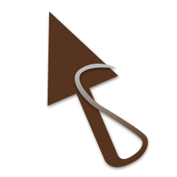

# Speedy Gonzales - Custom software mouse cursor addon for Godot

## Introduction

*Speedy Gonzales* is an easy custom software mouse cursor addon for Godot. It uses the `default_mouse_cursor_shape` property of [Godot controls](https://docs.godotengine.org/en/stable/classes/class_control.html) to show custom mouse cursors when hovering over them.

It's used as part of the *Egoventure Game Template* together with the [Egoventure](https://github.com/deep-entertainment/egoventure) and [Parrot](https://github.com/deep-entertainment/parrot) addons as a basis for first person point and click adventure games such as the Carol Reed series by [Mdna games](http://mdna-games.com/) since 2021.

## Usage

*Speedy Gonzales* relies on Control nodes and their `default_mouse_cursor_shape` property, but can also used without them.

To set a custom mouse cursor for one of the possible cursor shapes (see the CursorShape enum in [the input class](https://docs.godotengine.org/en/stable/classes/class_input.html)), use the following code:

```gdscript
Speedy.set_custom_mouse_cursor(
    preload("res://cursors/hand.png"),
    Input.CURSOR_POINTING_HAND,
    Vector2(10, 10)
)
```

This example would set a custom hand image for the pointing hand cursor shape with a hotspot at 10 x and 10 y.

Every time the mouse cursor is over a control that has `default_mouse_cursor_shape` set to `Input.CURSOR_POINTING_HAND`, Speedy will change the mouse cursor to the hand image.

**Be aware**, that *Speedy Gonzales* completely takes over mouse control, so all mouse cursor shapes need to be controlled by it.

For details refer to the [API-Docs](docs/api).

## Usage without Control nodes

If you only want to control the mouse cursor shape by code without relying on Control nodes, you can set:

```gdscript
Speedy.keep_shape = true
```

Speedy will not change the mouse cursor shape after that.
